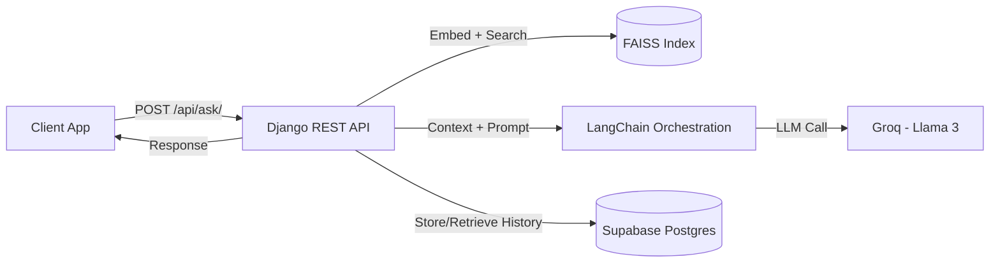

# Walpole Tutor Backend 

The backend API for **Walpole Tutor** — an AI-powered study companion for *Probability & Statistics for Engineers & Scientists*.

This service uses **Retrieval-Augmented Generation (RAG)** to produce accurate, context-aware answers grounded in the textbook content via semantic search + LLM reasoning.


---

## Contents

- [What this does](#what-this-does)
- [Architecture](#architecture)
- [Tech stack](#tech-stack)
- [Prerequisites](#prerequisites)
- [Getting started (local development)](#getting-started-local-development)
  - [Clone + Git LFS](#1-clone--git-lfs-required)
  - [Environment configuration](#2-environment-configuration)
  - [Run with Docker](#3-run-with-docker-recommended)
  - [Run manually](#4-run-manually-optional)
  - [Verify health](#5-verify-health)
- [API](#api)
  - [Endpoints](#endpoints)
---

## What this does

- Accepts a user question and optional chat context/history.
- Retrieves the most relevant textbook passages using a FAISS vector index.
- Builds a grounded prompt and calls an LLM (Groq, Llama-3).
- Returns an answer designed to stay aligned with the retrieved context.
- Persists chat/session history in Supabase (PostgreSQL), when enabled.

---

## Architecture


## Tech stack

- Framework: Django + Django Rest Framework (DRF)
- AI orchestration: LangChain
- Vector database: FAISS (local index for fast retrieval)
- LLM provider: Groq (Llama-3)
- Database: Supabase (PostgreSQL) for chat history & user sessions
- Server: Gunicorn (WSGI) behind Nginx
- Infrastructure: DigitalOcean Droplet (Ubuntu) with CI/CD via GitHub Actions

## Prerequisites

Install the following before running locally:

- Docker + Docker Compose
- Python 3.11+
- Git
- Git LFS (required to pull the FAISS vector index artifacts)
- Docker + Docker Compose

## Getting started (local development)

### 1) Clone + Git LFS (required)

```bash
git clone https://github.com/riyanj220/walpole-agent-backend.git
cd walpole-agent-backend

git lfs install
git lfs pull
```

### 2) Environment configuration

Create a `.env` file in the repo root.

Minimal example:

```env
# Django
DEBUG=True
SECRET_KEY=your-insecure-dev-key
ALLOWED_HOSTS=localhost,127.0.0.1

# LLM
GROQ_API_KEY=gsk_...

# Supabase (Database & Auth)
SUPABASE_URL=https://xyz.supabase.co
SUPABASE_SERVICE_KEY=eyJ...
```

### 3) Run with Docker (recommended)

This mirrors production more closely.

```bash
docker-compose up --build
```

API will be available at:

- http://localhost:8000

To stop:

```bash
docker-compose down
```

---

### 4) Run manually (optional)

```bash
python -m venv venv
source venv/bin/activate  # Windows: venv\Scripts\activate

pip install -r requirements.txt

python manage.py migrate
python manage.py runserver 0.0.0.0:8000
```

---

### 5) Verify health

```bash
curl http://localhost:8000/api/health/
```

---

## API

### Endpoints

| Method | Endpoint | Description |
|---|---|---|
| `POST` | `/api/ask/` | Main RAG endpoint. Accepts query and optional chat context/history. |
| `GET` | `/api/health/` | Health check (e.g., DB/vector store status). |
| `GET` | `/api/chapters/` | Returns list of available textbook chapters. |

